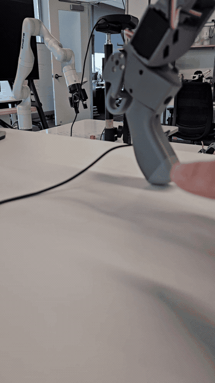

# Kinova Gen3 Lerobot Environment

This repository extends [Hugging Face LeRobot](https://github.com/huggingface/lerobot) with support for the Kinova Gen3 robot, its integrated vision module, and SO-101 leader-arm teleoperation.

[](#citation)
[](LICENSE)
[](https://github.com/huggingface/lerobot)

> [!IMPORTANT]
> The Kinova integration is experimental and requires hardware validation for each robot setup. Review the [safety guidance and known limitations](docs/kinova/README.md) before connecting a robot.

## Capabilities

- Kinova Gen3 joint and gripper observations and actions.
- Dataset recording and policy rollout through `lerobot-record`.
- SO-101 leader-arm teleoperation through `kinova_gen3_so101_leader`.
- A fixed-action teleoperator through `kinova_gen3_teleop_no_op`.
- Kinova wrist-camera capture and ordinary OpenCV camera support.

The Kinova wrist camera uses the robot's RTSP stream and may have noticeable latency. For latency-sensitive teleoperation or closed-loop policy execution, mount a USB or other low-latency camera and configure it as an OpenCV camera. See the [Kinova camera guide](docs/kinova/cameras.md).

## Demonstrations

<table>
  <tr>
    <td align="center"></td>
    <td align="center"></td>
  </tr>
  <tr>
    <td><strong>SO-101 leader-arm teleoperation.</strong> The apparent response lag shown here is due to conservative speed safety limits configured on the Kinova arm, not latency in the leader-arm interface.</td>
    <td><strong>VLA inference.</strong> The policy follows the prompt <em>“Pick up the eraser and put it in the box”</em> after fine-tuning on 40 episodes of the task. An additional webcam was mounted on the wrist and used instead of the integrated Kinova camera stream to avoid its latency.</td>
  </tr>
</table>

## Quick start

```bash
git clone https://github.com/JHUAPL/lerobot-kinova-gen3.git
cd lerobot-kinova-gen3
pip install -e ".[kinova,feetech]"
```

The supported Kinova command-line entry point is `lerobot-record`.

| Use case | Entry point | Status |
| --- | --- | --- |
| Record demonstrations with an SO-101 leader | `lerobot-record` + `kinova_gen3_so101_leader` | Implemented; hardware revalidation required |
| Run a policy and record evaluation episodes | `lerobot-record --policy.path=...` | Experimental; hardware revalidation required |
| Use the integrated wrist camera | `kinova_gen3_vision` | Implemented with known latency concerns |
| Use an externally mounted camera | OpenCV camera configuration | Recommended for latency-sensitive work |
| Supply fixed zero-valued actions | `kinova_gen3_teleop_no_op` | Not a simulator or safety mechanism |

The standalone `lerobot-teleoperate`, `lerobot-replay`, `lerobot-calibrate`, and `lerobot-setup-motors` commands do not currently register the Kinova components.

## Documentation

- [Kinova Gen3 setup, safety, and operation guide](docs/kinova/README.md)
- [Kinova camera guide](docs/kinova/cameras.md)
- [Upstream LeRobot documentation](https://huggingface.co/docs/lerobot/index)
- [Third-party software notices](THIRD_PARTY_NOTICES.md)

The files under `docs/source/` are retained as source for the upstream Hugging Face documentation system. The repository-renderable Kinova documentation is maintained separately under `docs/kinova/`.

## Citation

This beta is version `0.1.0-beta.1`. If you use the Kinova integration, cite both this software and upstream LeRobot. Machine-readable metadata is provided in [CITATION.cff](CITATION.cff).

```bibtex
@software{pyles_kinova_gen3_lerobot_2026,
  author  = {Pyles, Connor and Camargo, Frank and Fifer, Mathew},
  title   = {Kinova Gen3 Lerobot Environment},
  version = {0.1.0-beta.1},
  year    = {2026},
  url     = {https://github.com/JHUAPL/lerobot-kinova-gen3}
}
```

```bibtex
@misc{cadene2024lerobot,
  author       = {Cadene, Remi and Alibert, Simon and Soare, Alexander and Gallouedec, Quentin and Zouitine, Adil and Palma, Steven and Kooijmans, Pepijn and Aractingi, Michel and Shukor, Mustafa and Aubakirova, Dana and Russi, Martino and Capuano, Francesco and Pascal, Caroline and Choghari, Jade and Moss, Jess and Wolf, Thomas},
  title        = {LeRobot: State-of-the-art Machine Learning for Real-World Robotics in Pytorch},
  howpublished = {\url{https://github.com/huggingface/lerobot}},
  year         = {2024}
}
```

## License and attribution

LeRobot and this integration are distributed under the [Apache License 2.0](LICENSE). The bundled Kinova Kortex API wheel is treated as BSD-3-Clause licensed; see [Third-Party Notices](THIRD_PARTY_NOTICES.md) and the reproduced [Kinova Kortex license](THIRD_PARTY_LICENSES/KINOVA_KORTEX_BSD-3-CLAUSE.txt).

Copyright © 2026 The Johns Hopkins University Applied Physics Laboratory LLC. This copyright applies to original contributions and modifications made for the Kinova Gen3 integration.

This project is not an official Hugging Face or Kinova release.
